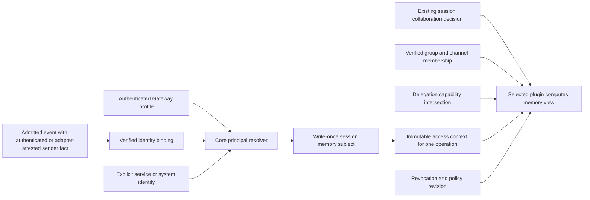
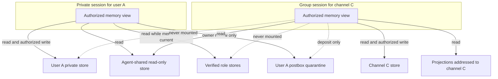
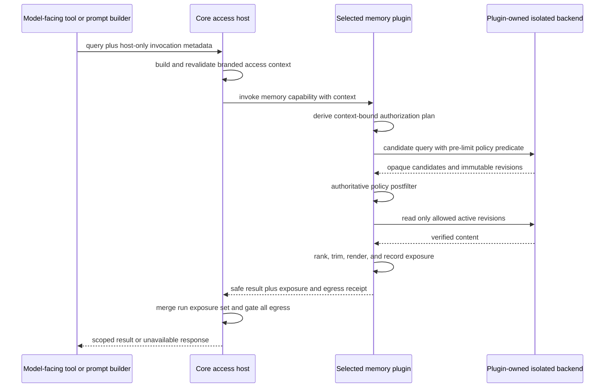
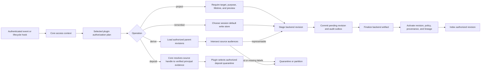
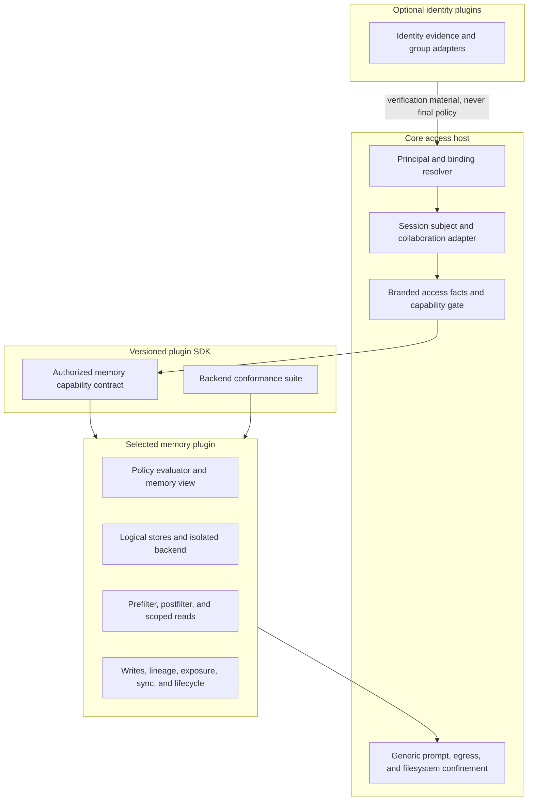
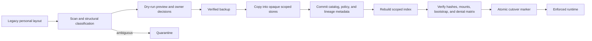
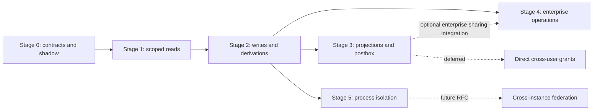

<Warning>
This page is an implementation design, not shipped behavior. OpenClaw does not
currently use memory ACLs as a security boundary. After Stage 2, a deployment
may claim only the cooperative-isolation boundary it has tested. Stage 5 is
required for a tested model/process-adversarial claim. Mutually untrusted or
hostile tenants still require separate agents or separate Gateway, credential,
and storage cells. See [Multi-user mode](/concepts/multi-user).
</Warning>

OpenClaw memory was designed for a personal agent. Its Markdown files,
per-agent index, bootstrap context, transcript recall, and background
consolidation all assume that the agent's audience is one trust domain. A
shared DM inbox or group channel breaks that assumption: routing may separate
conversations, but every conversation can still reach the same agent memory.

This design adds identity-aware memory without turning model instructions into
an authorization mechanism. It uses verified principals, isolated logical
stores, a core-issued access context, plugin-owned policy evaluation, and an
authoritative postfilter before content reaches a prompt. The builtin backend
maps stores to opaque Markdown roots; other conforming backends may use
isolated collections or namespaces. The design also covers writes, session
transcripts, compaction, dreaming, delegation, sharing, revocation, migration,
and audit.

## Why multiplayer memory fails

Current memory records what was learned and where it came from, but not who may
receive it later. That missing audience dimension produces three recurring
failures.

**Cross-participant leakage.** A fact learned from one person can be retrieved
for another person when both conversations use the same agent-level files and
index. Separating route keys does not help if every route still reaches the same
memory.

**The implicit-subject problem.** Personal memory can safely record "prefers
short replies" only while there is one implicit person. In a group, the subject
disappears. Similarity search can find every passage about "Mike," but it cannot
decide which Mike a fact describes or whether that fact is still current.
Identity must narrow the store before lexical or semantic ranking begins.

**Compaction as a laundering channel.** Transcripts, summaries, memory flushes,
and dreaming outputs are durable derived artifacts. If any of them drops its
source audience, scoped content becomes a clean, unscoped copy. A design that
protects search but not derivation still has a direct disclosure path.

## Design principles

1. **Resolve identity before retrieval.** Determine the session subject and
   current verified evidence before opening a store or issuing a candidate
   query. Search ranks facts only after authorization establishes whose view is
   being searched.
2. **Isolation comes from placement, not predicates.** Personal, channel, role,
   shared, projection, and quarantine content live in separate logical stores.
   Policy rows may narrow a mounted view; they never compensate for attaching
   the wrong store.
3. **Deny by default.** A resource is unavailable unless the current memory
   view and policy permit the requested operation. Backend failure never falls
   back to an unscoped store.
4. **The session subject is not the latest actor.** Steering changes who caused
   an operation, not the audience boundary of the shared context.
5. **Derived artifacts keep their source restrictions.** Compaction,
   transcripts, dreaming, exports, and projections use the same policy
   lifecycle as direct memory reads and writes.
6. **State the isolation strength honestly.** In-process authorization can
   constrain cooperative and model-facing access, but process-adversarial
   claims require a broker and sandbox boundary that the deployment has
   actually tested.

## Decision summary

- Preserve today's single-user behavior until an operator explicitly migrates
  an agent. Do not reinterpret existing files at runtime.
- Resolve a durable principal after authentication and ingress admission. A
  sender label, session key, static `identityLinks` entry, or prompt field is
  never an ACL principal.
- Stamp each session with one immutable memory subject: verified user for an
  isolated DM, channel for a group, or service agent for an autonomous run.
  The verified or unattributed actor evidence may change, but steering never
  changes the session's retrieval subject. Reset, fork, and import paths must
  preserve or explicitly quarantine that subject rather than infer a
  replacement from routing text.
- Keep personal, channel, role, agent-shared, projection, and quarantine
  content in separate logical stores under opaque IDs. Expose only an
  authorized virtual view to a session.
- Reuse `session_members` and the existing Gateway session-sharing evaluator
  for Gateway collaborative-session audiences only. Native channel and
  enterprise-role membership remains separately verified, revisioned,
  expiring provider evidence. Do not confuse ingress access groups with memory
  ACL groups.
- Make a generic, versioned authorization contract part of core and the plugin
  SDK. Core supplies verified access facts and generic confinement; the
  selected memory plugin owns its stores, policy, lineage, search, postfilter,
  and exposure records. Enforced mode rejects a backend that cannot honor the
  contract.
- Apply the same policy to bootstrap files, `memory_search`, `memory_get`,
  trigger injection, active recall, generic file tools, memory flush, dreaming,
  transcripts, compaction, child agents, and every alternate memory backend.
- Implement controlled sharing as an explicit projection into a named
  audience. Keep direct user-to-user grants deferred.
- Treat in-process enforcement as protection against accidental and
  model-driven disclosure inside one trusted Gateway. A process-adversarial
  claim requires sandboxed agents and an out-of-process broker. Hostile tenants
  require separate Gateway, process, credential, and storage cells.

## Isolation model at a glance

**Channel memory is the group default.** Content learned in a group session is
written to that conversation's store. The conversation remains the session
subject even when another member steers the run, so changing the latest actor
does not change the audience.

**Private stores never mount into group sessions.** A group query about one of
its members may use channel memory, agent-shared memory, and projections
addressed to that channel. It cannot search, exact-read, or otherwise reach the
member's private or role stores.

**The postbox is a one-way deposit valve.** A group may file an observation
from a verified source message into one participant's quarantine. The group
receives only a generic outcome and cannot list, search, or read the deposited
item back.

**Projections are explicit declassified copies.** A projection names one
audience, source revision, purpose, publisher, and lifetime. It is never
inferred by the model, and a later source edit does not silently republish it.

## Design inputs

This plan combines three sources with the current OpenClaw implementation:

- [RFC 0010 draft](https://github.com/openclaw/rfcs/pull/30), reviewed at head
  `a925820bd766f6a5df79d44323db0e8eb55649ac`, contributes the session subject,
  structural mount, deny-by-default evaluator, authoritative postfilter,
  postbox, projection, lineage, and exposure-audit ideas. Its three changed
  files are the proposal, implementation plan, and broker design. The RFC is a
  draft, and some implementation assumptions predate the current codebase.
- [Shared vs private AI agent memory](https://www.mindstudio.ai/blog/shared-vs-private-ai-agent-memory-team-access-control)
  separates global, role, and user tiers; enforces permissions below the
  prompt; applies least privilege independently at each agent hop; and treats
  writes, audit, revocation, and retention as first-class controls.
- [Designing agent memory for multiplayer](https://bloome.im/blog/designing-agent-memory-for-multiplayer)
  makes identity structural: first answer "who is this for?" and only then
  search. It also separates a very small, always-loaded profile card from
  larger notes that are searched on demand.

The resulting design deliberately changes several RFC details. It reuses
OpenClaw's existing session collaboration policy, does not treat current
access groups as general ACL groups, stores opaque IDs rather than provider
identifiers in paths, quarantines ambiguous legacy content instead of making
it shared, and requires projections to name their audience.

## Current state and gaps

The following seams already exist. They are foundations, not multiplayer
memory enforcement.

| Surface                | Current behavior                                                                                                                                                                                                                    | Gap this design closes                                                                                                                                    |
| ---------------------- | ----------------------------------------------------------------------------------------------------------------------------------------------------------------------------------------------------------------------------------- | --------------------------------------------------------------------------------------------------------------------------------------------------------- |
| Routing                | `src/routing/session-key.ts` can collapse DMs into `main` or separate them by peer. Group keys identify a conversation, not a sender.                                                                                               | A route key is not a verified person or an authorization decision.                                                                                        |
| Gateway identity       | Durable Gateway user profiles and write-once `createdActor` provenance exist. Channel senders are not bound to those profiles.                                                                                                      | Add an explicit, verified channel identity binding; keep creation attribution separate from memory authority.                                             |
| Session collaboration  | `src/gateway/session-sharing.ts` and `src/config/sessions/session-sharing-store.ts` already centralize owner, member, viewer, admin, draft, read-only, and suggest decisions.                                                       | Feed these decisions into memory authorization instead of inventing parallel membership rules.                                                            |
| Ingress access groups  | `src/channels/message-access/` controls whether a transport event may enter the system. Dynamic provider failures fail closed.                                                                                                      | Ingress admission does not grant durable memory access. Role and group principals need verified, revisioned identity evidence.                            |
| Memory plugin boundary | `src/plugins/memory-state.ts`, `src/plugins/memory-runtime.ts`, and `packages/memory-host-sdk/src/host/types.ts` expose one selected memory runtime and a `MemorySearchManager`.                                                    | The contract carries agent and session IDs, but no canonical principal, authorized view, resource revision, or policy decision.                           |
| Markdown and index     | `memory-core` indexes `MEMORY.md`, `USER.md`, `memory/`, and optional session sources into the per-agent SQLite database. Chunk rows contain full text and serialized embeddings; provenance records trust origin and session kind. | Provenance answers "where did this come from?", not "who may receive it?" The content-bearing derived index is agent-scoped, not user- or channel-scoped. |
| Search and exact read  | `extensions/memory-core/src/tools.ts` filters transcript hits and lets the trusted runtime narrow the requested corpus. `packages/memory-host-sdk/src/host/read-file.ts` prevents path traversal and symlink escape.                | Ordinary memory hits and exact reads can still reach every allowed memory path in the agent workspace.                                                    |
| Transcript recall      | `extensions/memory-core/src/session-search-visibility.ts` already excludes group and channel aliases from private cross-conversation recall and fails closed on conflicting aliases.                                                | Visibility is inferred from session shape and current policy, not a persisted canonical audience label.                                                   |
| Bootstrap and dreaming | The curated tier is loaded or referenced at session start, and dreaming promotes eligible evidence with trust provenance.                                                                                                           | A single `MEMORY.md` and `USER.md` have no human audience. Flush and dreaming can copy scoped content into a broader file.                                |
| Compaction             | Compaction persists a plain-text summary and transcript checkpoint.                                                                                                                                                                 | Current summaries and preserved-turn rendering drop authorization labels, so audience cannot safely be reconstructed later.                               |
| Files and sandbox      | `ToolFsPolicy` currently expresses `workspaceOnly`; sandbox workspace mounts are whole-workspace `none`, `ro`, or `rw`.                                                                                                             | There is no session-specific allowlist of memory roots. Unsandboxed `exec` can bypass model-facing file guards.                                           |

Two current protections remain useful after this design lands:

1. The runtime, not model-authored tool arguments, chooses whether transcript
   recall is available and which corpus may be searched.
2. Memory path readers already reject traversal, unexpected file types, and
   symlink escapes. Scoped readers should build on those checks rather than
   replacing them.

The initial bypass inventory must also include non-tool callers. Active Memory
trigger recall, project bootstrap, Talk fast context, memory wiki supplements,
and the LanceDB plugin's prompt hook all reach memory through independent
paths today. A scoped `memory_search` implementation is not complete while any
of those paths remains context-free.

## Goals

1. A private DM can remember facts for its verified user without exposing them
   to another user, a group, an autonomous run, or an unrelated agent.
2. A group remembers what happened in that group without silently learning a
   readable copy of each participant's private profile.
3. Shared and role memory has explicit read and write authority. A group does
   not gain role memory merely because one participant has that role.
4. Identity is decided before retrieval. Semantic similarity is never used to
   decide which person a fact belongs to.
5. Every path that can put memory into a model prompt or durable derived
   artifact uses the same policy context and decision semantics.
6. Every write has an owner, audience, trust origin, resource revision, and
   audit actor. An unlabeled write fails closed or enters quarantine.
7. Revocation stops future reads and derivations, and exposure records make
   residual copies enumerable.
8. Single-user installs keep their current files and behavior until an explicit
   migration, with no required enterprise identity provider.

## Non-goals

- This does not make one Gateway a hostile multi-tenant boundary. The host
  operator, admins, installed in-process plugins, and processes with direct
  state-directory access remain trusted.
- This cannot make a model forget content already placed in its context. It can
  prevent new retrieval, track exposure, and restrict derived writes, but it
  cannot prevent semantic rephrasing of already-seen information.
- This does not infer sensitivity from prose or add a general DLP classifier.
- This does not use display names, usernames, email strings, embeddings, or
  model judgment to merge identities.
- This does not add cross-instance federation.
- This does not ship direct private-store grants from one user to another.
- This does not move plugin KV or arbitrary workspace files into the memory
  authorization system.

## Threat model

Authorization controls which durable content may enter a run; it cannot make a
model forget content already exposed in that run. The model may paraphrase or
be influenced by authorized content without preserving token-level lineage.
Exposure records and anomaly checks can detect suspicious follow-on writes,
but they cannot prevent this semantic laundering.

The rollout has three explicitly different claims.

| Level                         | Claim                                                                                                         | Required controls                                                                                                                                                                                                     |
| ----------------------------- | ------------------------------------------------------------------------------------------------------------- | --------------------------------------------------------------------------------------------------------------------------------------------------------------------------------------------------------------------- |
| Cooperative isolation         | Prevent ordinary cross-user mistakes and make policy decisions observable.                                    | Core identity context, scoped backend contract, authoritative postfilter, guarded bootstrap and writes.                                                                                                               |
| Model-adversarial isolation   | A prompt-injected model cannot use available tools to open an unmounted memory store.                         | All cooperative controls plus session-specific file policy, no unguarded host file tools, and a sandbox that exposes only the virtual memory view.                                                                    |
| Process-adversarial isolation | Compromise of a non-broker agent or tool process cannot cross its issued view.                                | All model controls plus an out-of-process broker with authenticated IPC, no broker credentials in the agent process, and OS separation. Gateway, broker backend, selected memory plugin, and operator remain trusted. |
| Hostile-tenant isolation      | Mutually untrusted tenants do not share a trusted Gateway, plugin host, credential set, or storage authority. | Separate Gateway, process, credential, and storage cells for each trust domain.                                                                                                                                       |

Enforced multiplayer mode must not claim a stronger level than the deployment
provides. In particular, unsandboxed `exec` over the host workspace is
incompatible with model-adversarial isolation. Memory failure should fail
closed for memory while leaving the conversation available: the reply may
continue with an explicit "memory unavailable" result, but it must never fall
back to an unscoped store.

## Vocabulary and invariants

**Principal** is a durable, canonical identity such as a Gateway profile, a
verified enterprise subject, a service agent, or a system actor. Provider
display fields are aliases or evidence, not principals.

**Session subject** is the audience identity stamped once when a session is
created: one user, one channel, or one service agent. It controls retrieval and
the default write target. It is not necessarily the actor sending the current
message.

**Actor** is the authenticated human, agent, or system process causing one
operation. Actors are used for audit, collaboration roles, and postbox source
attribution. In a group session, changing actors does not change the channel
subject.

**Store** is one logical storage and policy boundary with exactly one base
scope, one agent cell, one authority owner, and an opaque `store_id`. Builtin
memory maps it to a physical Markdown root. An external backend may map it to
an isolated collection or namespace if it supplies equivalent inspection,
export, lifecycle, and conformance behavior. Provider, tenant, channel, and
user IDs never appear in filesystem paths or backend locator tokens.

**Resource** is one versioned logical artifact or stable record registered in
the selected plugin's policy catalog. A builtin resource is usually Markdown.
Index chunks point to an immutable resource revision; they are not
authorization objects themselves.

Each resource keeps four independent dimensions:

- **Subject:** who or what the fact describes. A channel note can be about
  Alice while remaining channel-audience data. Subject supports exact person
  lookup; it never grants access.
- **Origin:** where and from whom the evidence came, including trust class and
  source event. Origin affects promotion and review; it does not by itself set
  the audience.
- **Audience:** which user, channel, role, agent, or agent-shared scope may
  receive the content.
- **Authority:** which actors may append, replace, derive, project, delete, or
  administer the resource.

Conflating any two recreates a leak. In particular, a note about Alice is not
automatically private to Alice, and a note written by Alice is not
automatically readable only by Alice.

**Memory view** is the immutable set of store mounts and per-mount capabilities
computed by the selected plugin for one operation from the session subject,
actor, collaboration policy, delegation, current memberships, revocations,
physical authority, and backend capability.

The implementation must maintain these invariants:

1. No model argument can add a principal, store, audience, or permission.
2. A session subject is persisted write-once on the logical session node.
   Reset successors, transcript branches, forks, checkpoint restores, and
   rewinds copy the exact source subject and source-policy set as immutable
   provenance. Current binding, membership, and revocation state is rechecked
   separately and may deny every operation without rewriting that provenance.
   A flow that cannot prove source lineage is not a successor; it is a
   quarantined import with no memory view. Import into a differently scoped
   session requires a reviewed projection or quarantine, and choosing another
   session key is never a transfer.
3. Every readable resource belongs to the same hard `agent_id` cell and to a
   store mount in the plugin-computed memory view.
4. The candidate prefilter may over-include, but it must never exclude a
   resource the canonical evaluator would allow. The postfilter is always
   authoritative.
5. No snippet, path, count, rank, cursor, or denial detail for an unauthorized
   resource reaches a model-facing response.
6. A derived resource is never readable by a broader audience than every
   source resource. Mixed audiences are partitioned or quarantined.
7. A write target comes from trusted runtime context. A model may narrow an
   operation or choose content, but it cannot name another user's store.
8. Disabling or failing a memory plugin makes memory unavailable. It never
   disables core path, bootstrap, or identity enforcement.
9. Runtime reads only the new canonical layout after migration. There is no
   dual-read, lazy import, or unscoped fallback.

## Identity and session subject

### Resolution flow



Channel resolution happens after transport authentication or trusted-adapter
attestation and shared ingress admission, before route dispatch. Core verifies
issuer, signature, and audience where the protocol supports them; otherwise it
records the registered adapter and assurance level. The trusted carrier must
not live in model-visible message text or in an extensible `MsgContext` extras
bag. Gateway UI calls resolve from the authenticated durable user profile.
Cron, webhook, heartbeat, and child-agent runs receive explicit service or
delegated identities; they never synthesize an owner from a session key.

The logical binding key is the tuple `(channel, account, normalized stable
sender ID)`. Persist an opaque keyed-HMAC lookup key for that tuple, not the raw
provider ID, unless a protected operational workflow explicitly needs the raw
value. A binding records the canonical principal, adapter and assurance,
verification method, evidence revision, creation actor, creation time, and
revocation time. Raw provider identifiers stay out of paths, logs, and audit.
Usernames, display names, phone numbers, and email aliases may assist a human
linking flow, but they cannot create or update a binding by equality alone.

Existing `identityLinks` continue to affect DM route grouping only. Existing
access groups continue to decide ingress admission only. Neither surface is
silently promoted into memory authority.

The current collaboration fallback that treats a profile-less client as an
owner in a trusted deployment remains a chat-control compatibility rule only.
It never creates a memory principal, private subject, or personal-store grant.
Without a durable authenticated principal, the memory subject is `ambiguous`
and private memory is unavailable.

### Trusted types

The exact names may change during implementation, but the separation should
remain:

```ts
declare const memoryContextBrand: unique symbol;
declare const memoryPlanBrand: unique symbol;
declare const memoryExposureReceiptBrand: unique symbol;
declare const memoryEgressReceiptBrand: unique symbol;

type DeepReadonly<T> = T extends readonly (infer U)[]
  ? readonly DeepReadonly<U>[]
  : T extends object
    ? { readonly [K in keyof T]: DeepReadonly<T[K]> }
    : T;

type SubjectEvidenceRef = Readonly<{
  kind: "gateway-profile" | "channel-binding" | "adapter-attested" | "explicit-service";
  revision: string;
}>;

type AudienceRef = Readonly<{
  kind: "user" | "conversation" | "role" | "agent-shared" | "agent" | "internal";
  id: string;
}>;

type VerifiedPrincipalRef = Readonly<{
  principalId: string;
  assurance: "gateway-profile" | "adapter-attested" | "oidc" | "service";
  evidenceRevision: string;
  expiresAt?: string;
}>;

type SessionMemorySubject =
  | {
      kind: "user";
      principalId: string;
      creationEvidence: SubjectEvidenceRef;
    }
  | {
      kind: "conversation";
      conversationPrincipalId: string;
      channel: string;
      accountId: string;
    }
  | { kind: "service" | "agent" | "system"; principalId: string }
  | {
      kind: "ambiguous";
      reason: "shared-main" | "unbound" | "conflicting-bindings";
    };

type MemoryOperation =
  | "retrieve"
  | "read"
  | "append"
  | "replace"
  | "derive"
  | "deposit"
  | "project"
  | "publish"
  | "import"
  | "export"
  | "delete"
  | "sync"
  | "policy-admin";

type MemoryAccessContext = DeepReadonly<{
  readonly [memoryContextBrand]: true;
  version: 1;
  contextId: string;
  requestId: string;
  runId: string;
  agentId: string;
  sessionKey: string;
  sessionId: string;
  sessionIdentityRevision: string;
  subjectRevision: string;
  subject: SessionMemorySubject;
  actor:
    | {
        kind: "principal";
        actorKind: "human" | "agent" | "service" | "system";
        principalId: string;
        assurance: VerifiedPrincipalRef["assurance"];
        evidenceRevision: string;
        expiresAt?: string;
      }
    | {
        kind: "unattributed";
        transportAuditRef: string;
        evidenceRevision: string;
      };
  verifiedPrincipals: readonly VerifiedPrincipalRef[];
  conversation?: {
    conversationPrincipalId: string;
    channel: string;
    accountId: string;
    evidenceRevision: string;
  };
  delivery: {
    sinkKind: "private" | "channel" | "session" | "internal";
    audiences: readonly AudienceRef[];
    egressCapabilityIds: readonly string[];
    egressRegistryRevision: string;
    deliveryRevision: string;
  };
  collaboration:
    | {
        kind: "gateway-session";
        mode: "shared" | "read-only" | "suggest" | "draft";
        role: "admin" | "owner" | "member" | "viewer";
        decisionRevision: string;
      }
    | { kind: "not-applicable" };
  verifiedMemberships: readonly {
    principalId: string;
    groupId: string;
    provider: string;
    evidenceRevision: string;
    observedAt: string;
    expiresAt: string;
  }[];
  delegation?: {
    rootPrincipalId: string;
    rootContextId: string;
    parentContextId: string;
    parentMemoryPlanId: string;
    capabilitySnapshotId: string;
    allowedOperations: readonly MemoryOperation[];
    maximumAudiences: readonly AudienceRef[];
    storeCapToken: string;
    depth: number;
  };
  operation: MemoryOperation;
  hostFactsRevision: string;
}>;

type MemoryMount = DeepReadonly<{
  agentId: string;
  storeId: string;
  mountHandle: string;
  capabilities: readonly MemoryOperation[];
  audienceRevision: string;
}>;

type AuthorizedMemoryPlan = DeepReadonly<{
  readonly [memoryPlanBrand]: true;
  version: 1;
  planId: string;
  contextFingerprint: string;
  sessionIdentityRevision: string;
  subjectRevision: string;
  memoryPolicyRevision: string;
  deliveryRevision: string;
  operation: MemoryOperation;
  mounts: readonly MemoryMount[];
  bootstrapResourceHandles: readonly string[];
  allowedEgressAudiences: readonly AudienceRef[];
  expiresAt: string;
}>;

type MemoryExposureReceipt = DeepReadonly<{
  readonly [memoryExposureReceiptBrand]: true;
  version: 1;
  receiptId: string;
  contextFingerprint: string;
  planId: string;
  runId: string;
  runExposureRevision: string;
  sourcePolicySetId: string;
  exposedRevisionHandles: readonly string[];
  recordedAt: string;
}>;

type MemoryEgressAuthorizationReceipt = DeepReadonly<{
  readonly [memoryEgressReceiptBrand]: true;
  version: 1;
  receiptId: string;
  contextFingerprint: string;
  planId: string;
  runId: string;
  runExposureRevision: string;
  sourcePolicySetId: string;
  allowedAudiences: readonly AudienceRef[];
  deliveryRevision: string;
  egressRegistryRevision: string;
  expiresAt: string;
}>;

type AuthorizedMemoryResultEnvelope<T> = DeepReadonly<{
  value: T;
  exposureReceipt: MemoryExposureReceipt;
  egressReceipt: MemoryEgressAuthorizationReceipt;
}>;
```

`MemoryAccessContext` is created by core for each operation from the persisted
session subject and the current verified or unattributed actor. Its in-process
form is deep-frozen and host-branded; plugins receive it as a trusted host
parameter, never as tool JSON. Across Stage 5 IPC, the symbol brand becomes a
broker-authenticated envelope over the same serializable fields. The selected
memory plugin consumes those facts and returns an opaque
`AuthorizedMemoryPlan`; no caller may assemble mounts or raw store IDs. Read
authorization covers every possible delivery audience, not merely the actor
who triggered the run. This prevents a private fact from entering a group
response just because its owner spoke last.

Creation evidence is immutable provenance, not part of a principal's identity.
Every operation resolves the principal's current merge head, binding state,
membership evidence, and subject revision. Raw roles reported by a plugin are
not authoritative until core validates them; expired membership evidence
fails closed.

An admitted event without a durable principal uses the `unattributed` actor
variant. Its protected transport reference is audit provenance only and grants
no actor-based memory authority. It never causes core or a plugin to synthesize
a principal. `verifiedPrincipals` contains no actor-derived principal, but it
retains independently verified subject or collaboration principals. An
unattributed event cannot turn an ambiguous session into a private subject or
erase a valid conversation subject.

Core allocates a run/exposure ID for every content-bearing operation, including
operator CLI, status, sync, and export paths. A runtime cannot omit `runId` and
then return a receipt-producing result.

`session_nodes.session_key` names the logical session node, while its current
window mapping can change. Neither string is a human authorization identity.
Before exposure and before every mutation, core rereads the authoritative
session-key-to-current-session-ID mapping and the write-once subject row. A
stale context fails with `session-rebound`; it never follows a changed mapping
to a replacement window or conversation.

Once a run receives scoped content, its run exposure set constrains every
egress. Final replies, message and session-send tools, plugin or MCP outbound
actions, and fanout must all remain within the intersection of every exposed
resource audience. A route, sink, or delivery revision change invalidates the
authorization plan and egress receipt: deny delivery or rerun without the now-
ineligible content. An audit entry alone cannot make an unsafe delivery
acceptable.

Egress uses a mandatory capability registry, not a closed list of transports.
Every enabled tool capable of network, process, upload/export, browser, node,
webhook, plugin, MCP, file-delivery, or message side effects declares a stable
egress capability ID and passes the audience gate after a scoped exposure.
Unclassified egress is denied. Each authorization receipt binds the current
`runExposureRevision`, delivery revision, and registry revision; a receipt
issued before a later read is stale. Unsandboxed, network-capable `exec` is
incompatible with model-adversarial isolation even when its filesystem view is
scoped.

### Session mapping

| Session                                                   | Subject                                                    | Default readable stores                                                                          | Default write store                                                                                                                                  |
| --------------------------------------------------------- | ---------------------------------------------------------- | ------------------------------------------------------------------------------------------------ | ---------------------------------------------------------------------------------------------------------------------------------------------------- |
| Isolated DM with verified binding                         | User                                                       | That user's private store, the agent-shared store, and currently verified role stores            | That user's private store                                                                                                                            |
| Group, room, or channel                                   | Conversation                                               | That channel's store, the agent-shared store, and explicit projections addressed to that channel | That channel's store                                                                                                                                 |
| Gateway collaborative session                             | Stored session subject plus current collaboration decision | Intersection of subject view and existing session visibility decision                            | Only when the collaboration mode and role permit mutation                                                                                            |
| Cron, heartbeat, webhook, or autonomous run               | Service agent                                              | Agent store and the agent-shared store                                                           | Agent store                                                                                                                                          |
| Child agent                                               | Delegated subject                                          | Intersection of parent view, child task capability, and child session visibility                 | Explicit child target inside that intersection                                                                                                       |
| Shared-DM `main` session with more than one possible user | Ambiguous                                                  | Agent-shared resources explicitly classified safe for anonymous or local-cell use only           | No durable write                                                                                                                                     |
| Incognito session                                         | Existing subject, with an incognito visibility attribute   | Explicitly allowed agent-shared or ephemeral context only                                        | No durable memory, transcript-derived memory, flush, dream, or projection until a future explicit product/config contract is implemented and enabled |

OpenClaw currently defaults `session.dmScope` to `main`, which routes direct
messages through the shared main session (`src/routing/session-key.ts:229`). A
`main` session with more than one possible sender has no coherent private
subject, so it must never mount a user store.

The existing security checks already recommend `per-channel-peer`, or
`per-account-channel-peer` for multi-account channels, when multiple DM senders
share that session (`src/commands/doctor-security.ts:389`,
`src/security/audit-channel.ts:256`). Enforced mode promotes that advice to a
precondition for private memory. It reports the exact remediation through
`openclaw doctor` and refuses the private mount; it does not silently rewrite
the operator's session configuration.

A group never automatically mounts role memory based on the current sender.
Other participants share the same model context, so sender-specific role
memory would immediately become channel memory. A role fact must be explicitly
projected into the channel first.

Incognito is a session visibility attribute, not a memory audience grant. It
never widens a view. The conservative row above remains the enforced behavior
until the product explicitly defines a different durable-memory contract.

## Scope and storage model

### Scope kinds

| Scope          | Purpose                                                                              | Read rule                                                       | Write rule                                                 |
| -------------- | ------------------------------------------------------------------------------------ | --------------------------------------------------------------- | ---------------------------------------------------------- |
| `user`         | Private profile and durable notes for one verified person                            | Only that user's isolated subject, plus trusted admin workflows | That user's authorized DM workflows                        |
| `channel`      | Facts said or produced in one group conversation                                     | That channel subject while collaboration and membership permit  | Runs in that channel                                       |
| `role`         | Team or department memory                                                            | Verified role principal in a private or service context         | Named role publishers or admins                            |
| `agent-shared` | Reference material shared by scoped sessions of one agent                            | Every eligible subject in that agent cell                       | Explicit publisher only                                    |
| `agent`        | Autonomous operational memory                                                        | That service agent and trusted admin workflows                  | That service agent                                         |
| `projection`   | Deliberately declassified copy for one named channel, role, or agent-shared audience | The named target audience while the projection is live          | The projection publisher; no implicit source write-through |
| `quarantine`   | Ambiguous migration data, pending postbox deposits, and invalid policy state         | Admin review, or owner review for their own postbox             | Migration and deposit paths only                           |

Cross-agent, instance-wide shared or role memory is deferred. It needs a
separate canonical owner, database, lifecycle, and multi-agent authorization
design; a row in one agent's database must not silently become global.

### Storage roots and backend namespaces

Do not place every multiplayer store below one model-editable workspace tree.
The selected backend keeps a root registry that makes physical authority
explicit. For the local builtin backend, user stores are logically owned by a
principal, channel stores by a conversation or workspace, and agent-shared
stores by the agent's administrative owner. The broker process owns the host
files at Stage 5; logical owner authority still controls which operations it
may perform.

The local builtin default uses a controlled, versioned artifact area for each
agent, conceptually:

```text
{agent-state}/memory-scopes/v1/
  s1_7K4M.../
    PROFILE.md
    MEMORY.md
    notes/
  s1_B2PF.../
    CHANNEL.md
    notes/
  s1_N9TR.../
    postbox/
  s1_Q5DC.../
    projections/
```

The opaque directory key is generated with a CSPRNG and created with exclusive
`mkdir`; a collision retries with a new key. Its user, channel, role, or
agent-shared meaning exists only in the policy catalog. Store IDs and path keys
are distinct so doctor can rotate a path key without changing resource
identity. The catalog records `path_key_version`; `openclaw doctor --fix` owns
any path-key migration. This avoids leaking provider IDs through paths, path
instability after an account rename, and path injection from external
identifiers.

For builtin memory and QMD, Markdown remains the content source of truth and
stays inspectable through operator UI, CLI export, backups, and an authorized
virtual filesystem view. A conforming external backend may instead use an
isolated namespace or collection, but must provide equivalent inspection,
export, backup, deletion, revision, and recovery behavior. SQLite stores the
builtin plugin's identity references, policy, lifecycle, lineage, index, and
audit metadata; it is not a second canonical copy of a Markdown artifact. A
search index is content-bearing derived state because it contains chunk text
or embeddings, so it must sit inside the same trusted broker boundary.

### Catalog rows and derived indexes

The resource catalog stores authority metadata and artifact pointers, not a
second canonical copy of Markdown. For the builtin backend, an active resource
revision points to an immutable artifact locator and content hash. Scoped FTS
and vector chunks are content-bearing derived state inside the broker boundary.

After the policy postfilter authorizes a read, the backend resolves the active
revision and verifies its artifact hash before returning content. A missing
artifact, hash mismatch, or orphaned index row produces `revision-stale` or an
unavailable result; the backend never serves chunk text as a fallback copy.
Repair or reindexing must restore agreement before the revision becomes
readable again.

Deletion is symmetric across every access path. A tombstone or revocation makes
exact reads, candidate queries, exports, and derivations reject the revision
immediately. The plugin-owned lifecycle then retires its FTS, vector, and
fallback-search rows and removes the artifact through the recoverable write
state machine. A lagging index row remains denied, and an orphaned file never
becomes readable merely because it exists under a storage root.

### Front card and searchable notes

Each personal store has two intentionally different layers:

- `PROFILE.md` is the tiny front card: stable communication preferences,
  identity facts, and safety-critical context worth loading whenever that user
  has a private session. It has a hard character and entry budget.
- `MEMORY.md` and `notes/` hold detailed durable and episodic facts. They are
  available only through authorized retrieval unless a consolidation process
  promotes a bounded entry to the front card.

Channel, role, and agent-shared stores use the same pattern only when useful. A
channel may have a small `CHANNEL.md`; shared reference material is usually
search-only. No front card from one scope is concatenated into another scope.

### Subject lookup

Bloome's identity lesson applies inside every authorized store. Person
references use canonical subject IDs recorded in policy metadata, not names
recovered by similarity search. A channel resource about a participant stays
in the channel store but may carry that verified participant as its subject.
Two people named Mike remain two IDs even when their note text is similar.

Only trusted identity resolution may attach a canonical human subject. A model
may create an ordinary topic label or select a server-issued mention/message
handle, but it cannot assert that an arbitrary string is a verified person.
Subject lookup first narrows to the resolved ID inside the current memory view;
semantic or lexical ranking then finds relevant facts. Expiry and
supersession answer the second multiplayer question: whether the fact is still
current.

### Virtual mount topology



For filesystem-backed plugins, the virtual view is also the authority for
model-facing tools. A group sees virtual `channel/`, `agent-shared/`, and
`projections/` roots, not the real artifact area. Exact reads resolve through
the plugin catalog and a symlink-safe reader. A sandbox receives only those
roots. External backends expose opaque handles rather than fake host paths. In
enforced mode, a tool that cannot honor the view is hidden or denied.

## Authorization model

### Permission lattice

The RFC's retrieval lattice is useful but incomplete without write controls.
Use these implications:

```text
derive -> read -> retrieve
replace -> append

project, deposit, sync, destructive delete, publish, and policy-admin
are independent capabilities and never imply one another
```

| Requested operation                                                            | Required capabilities                     |
| ------------------------------------------------------------------------------ | ----------------------------------------- |
| `retrieve`                                                                     | `{retrieve}`                              |
| `read`                                                                         | `{retrieve, read}`                        |
| `derive`                                                                       | `{retrieve, read, derive}`                |
| `append`                                                                       | `{append}`                                |
| `replace`                                                                      | `{append, replace}`                       |
| `project`, `deposit`, `sync`, destructive delete, `publish`, or `policy-admin` | The requested independent capability only |

`retrieve` permits a candidate to exist inside the trusted broker. It does not
permit a snippet, path, title, score, or existence bit to leave the broker.
`read` permits content exposure. `derive` permits content to become an input to
a new durable resource. `project` is explicit declassification into a named
audience. `deposit` is the write-only postbox valve. `sync`, destructive
deletion, and publisher authority are independent. A policy administrator may
grant or revoke a capability but does not thereby exercise it: ambient admin
authority must never silently declassify private content.

Most resources need no explicit allow row. Placement in a store plus a valid
memory view supplies the common allow. ACL rows handle explicit denies,
publisher roles, expiry, and future exceptional sharing. No application path
creates a direct cross-user private-store allow in the initial design.

### Evaluation order

For requested permission `P`, evaluate in this order:

1. Core validates the context brand and version, request binding, current
   session-window mapping, subject revision, actor, delivery audience,
   delegation cap, and evidence expiry before invoking the memory capability.
2. The selected memory plugin validates that its plan is bound to that exact
   context fingerprint, operation, delivery revision, agent cell, and current
   memory-policy revision.
3. The plugin resolves the current memory view. A revoked identity, stale
   required group snapshot, or failed membership lookup removes the affected
   store.
4. Enforce the hard cell, agent, store, and virtual-mount boundary. An ACL can
   narrow this boundary but cannot override it.
5. Validate resource state: active immutable revision, matching content hash,
   non-expired, non-tombstoned, and a canonical path inside its store root.
6. Apply the core-validated Gateway session collaboration decision for
   session-backed content and mutation. Reissue or revalidate those host facts
   at exposure and commit time to avoid a revoke race.
7. Expand the permissions implied by `P`. Any matching deny on any required
   permission denies the operation.
8. Require placement authority or a matching, unexpired allow for every
   required permission.
9. Require the resource audience to cover every output audience in the
   operation context. Actor read authority alone is insufficient.
10. For a derived resource, require every inherited source-policy requirement
    plus any narrowing output policy; do not infer a broader policy from the
    current ancestor text.
11. Record a bounded decision trace and return either an opaque allowed handle
    or a stable denial reason.

Stable reason codes include `invalid-context`, `session-rebound`,
`delivery-rebound`, `plan-expired`, `identity-revoked`, `membership-stale`,
`outside-view`, `revision-stale`, `explicit-deny`, `default-deny`,
`lineage-deny`, and `backend-nonconforming`. Model-facing tools receive only a
safe unavailable or not-found result where detail could reveal another scope.

## Read and prompt path

### Authoritative pipeline



The order matters. Authorization occurs before result count, final ranking,
pagination, or rendering. An unauthorized nearest neighbor must not displace
an authorized result and thereby leak information through result shape.
Adaptive over-fetch may fill the requested number of allowed results, but
denial counts stay internal.

The prefilter is an optimization with one required property:

> Every resource the canonical evaluator would allow is included in the
> prefilter candidate superset.

The selected plugin's postfilter is the memory security boundary. A prefilter
false positive is safe but observable as policy drift; a false negative is a
correctness bug. Use property tests to compare generated policy states against
the plugin's pure evaluator. In practical terms, the prefilter may be loose;
confidentiality never depends on it. Core never interprets store kinds, ACL
rows, or bundled backend IDs.

### Authorized runtime contract

The current `MemorySearchManager` accepts an optional session key and returns
content-bearing hits. Enforced mode needs a versioned contract such as:

```ts
type MemoryAuthorizationCapabilities = Readonly<{
  version: 1;
  scopedCandidates: true;
  exactReadByAuthorizedHandle: true;
  scopedSync: true;
  scopedWrite: true;
  scopedExport: true;
  exposureReceipts: true;
  egressReceipts: true;
}>;

interface AuthorizedMemoryRuntime {
  authorization: MemoryAuthorizationCapabilities;
  authorize(context: MemoryAccessContext): Promise<AuthorizedMemoryPlan>;
  searchAuthorized(params: {
    context: MemoryAccessContext;
    plan: AuthorizedMemoryPlan;
    query: string;
    subjectHandles?: readonly string[];
    sources?: readonly ("memory" | "sessions")[];
    limit: number;
    signal?: AbortSignal;
  }): Promise<AuthorizedMemoryResultEnvelope<MemorySearchResult>>;
  readAuthorized(params: {
    context: MemoryAccessContext;
    plan: AuthorizedMemoryPlan;
    handle: AuthorizedResourceHandle;
    from?: number;
    lines?: number;
  }): Promise<AuthorizedMemoryResultEnvelope<MemoryReadResult>>;
  writeAuthorized(params: {
    context: MemoryAccessContext;
    plan: AuthorizedMemoryPlan;
    mutation: AuthorizedMemoryMutation;
  }): Promise<MemoryWriteResult>;
  syncAuthorized(params: {
    context: MemoryAccessContext;
    plan: AuthorizedMemoryPlan;
  }): Promise<AuthorizedMemoryResultEnvelope<MemorySyncResult>>;
  exportAuthorized(params: {
    context: MemoryAccessContext;
    plan: AuthorizedMemoryPlan;
    handles: readonly AuthorizedResourceHandle[];
  }): Promise<AuthorizedMemoryResultEnvelope<MemoryExportResult>>;
}
```

The plan is plugin-issued and bound to the context fingerprint, session and
subject revisions, operation, mounts, policy revision, delivery revision,
egress audiences, and expiry. No selected or supplemental backend exposes a
context-free overload or one that accepts caller-assembled store IDs. Exact
reads, writes, deletes, imports, sync, and every candidate branch revalidate the
plan and resource revision. A returned handle is not a bearer grant.

Every search or exact-read result that exposes content uses the mandatory
result envelope with both branded receipts, recorded before the content leaves
the plugin. The capability flags make that requirement discoverable during
backend admission. Core rejects a missing or invalid exposure receipt before
prompt assembly, and rejects an egress receipt whose context, delivery,
registry, policy-set, or `runExposureRevision` no longer matches.
Sync, export, public-artifact reads, and any future method that emits content
use the same envelope; a plain content-bearing return type is nonconforming.

Before each branch's final limit, the backend applies a full over-approximating
resource-policy predicate, not only a store-placement filter. Continuation or
adaptive widening continues until it has the authorized top K or exhausts the
eligible corpus. The authoritative plugin postfilter runs immediately before
any snippet, content, score, path, or existence bit leaves the plugin. The
conformance suite exercises the current sqlite-vec KNN, vector-scan fallback,
FTS/LIKE, and exact-path branches independently.

Candidate rows carry stable resource ID, immutable revision ID, store ID,
source, and score, but no content until the plugin evaluator allows `read`.
Core supplies verified principal facts; the selected plugin may turn those
facts or server-issued mention/message references into subject handles. Free-
form model text cannot create them.

Builtin memory should implement the contract first. QMD and other selected
memory plugins need conformance adapters that use separate authorized
collections or an equivalent native scope. A backend returning already
rendered snippets can be supported only when its process is inside the trusted
broker boundary and its native filter has passed conformance tests. Enforced
mode rejects a legacy backend instead of falling back to broad search.

### Every read lane uses the same view

- **Bootstrap:** prompt assembly invokes the selected capability for authorized
  front-card resources. It never reads root `MEMORY.md` or `USER.md` directly
  in multiplayer mode.
- **Memory prompt guidance:** guidance may direct the model to memory tools, but
  those tools receive the same view. Disabling the tool does not restore raw
  file injection.
- **Search:** model-selected `corpus` can narrow the trusted runtime's source
  set but cannot add sessions, stores, or supplements.
- **Exact get:** search returns an opaque, revision-bound resource handle.
  Human-friendly virtual paths may be displayed, but a raw path is resolved
  only inside the current view.
- **Trigger and active recall:** automatic injection is more sensitive than an
  explicit tool call, so it uses the same `read` decision and only authorized
  curated resources.
- **Plugin tools and hooks:** `memory-lancedb` recall, store, and forget tools,
  its `before_prompt_build` auto-recall and auto-capture, and any future raw
  `registerTool` or prompt hook must invoke the selected memory capability with
  the host context. Enforced mode rejects direct memory-content injection.
- **Supplements and preparations:** `MemoryPromptSupplement`,
  `MemoryPromptPreparation`, and `MemoryCorpusSupplement` registrations must
  declare an authorized store or route through the selected capability. This
  includes memory wiki Gateway/CLI paths, public artifacts, QMD extra
  collections and session artifacts, and project bootstrap supplements.
- **Import and export:** Codex, Claude, Hermes, and other import targets enter
  the scoped write lifecycle; exports require an authorized plan and preserve
  or explicitly warn about audience metadata.
- **Session history:** current session visibility remains a necessary check.
  The persisted transcript audience becomes an additional mandatory check.
- **Status and CLI:** operator commands authenticate explicitly. They do not
  call a context-free manager method that happens to bypass session policy.

## Write, derive, and share path

### Write flow



The content-producing model never chooses `store_id`, owner principal, or raw
artifact root. A private session writes to its user store, a group session to
its channel store, and an autonomous session to its agent store. Agent-shared
and role writes require an explicit publisher operation outside ordinary memory
capture.

Model-facing generic `write`, `edit`, and `apply_patch` calls against a virtual
memory path must delegate to the same broker write transaction. A direct host
path into the controlled artifact area is not a valid model tool target.

Human or administrator edits remain supported. The operator opens an
authorized store through CLI or UI; the watcher validates the store root,
records an admin actor, bumps the resource revision, and reindexes. A new file
with no valid catalog mapping enters quarantine rather than becoming shared.

### Crash consistency

Markdown and SQLite cannot share one atomic transaction. Use a recoverable
state machine for the builtin filesystem backend:

1. Validate the expected active revision and policy, then stage the new file
   with restrictive permissions and fsync it. Finish all filesystem work for
   this phase before opening a transaction.
2. In one short synchronous SQLite transaction, reread authority and revisions,
   insert an immutable `pending` revision and write intent, and enqueue the
   corresponding local audit/outbox record. Commit without touching the
   filesystem.
3. Atomically rename the staged file to its revision-scoped final locator,
   fsync it, and compute its finalized hash outside any database transaction.
   Revision files are broker-owned and immutable after this point.
4. In a second short synchronous transaction, compare the pending row with the
   already prepared finalized-hash fact, mark that revision `active`, repoint
   the resource's current revision, and finalize lineage and audit-outbox
   state. The callback performs no `stat`, open, read, or hash operation.
5. Readers resolve only active revisions. Startup recovery completes a valid
   pending intent or quarantines orphan files and rolls back invalid pending
   rows. Reads and recovery verify the immutable file hash again, so a changed
   live-looking filename never grants readability by itself.

No SQLite transaction callback performs filesystem access or awaits plugin,
model, membership, or network work. External backends must document and test an
equivalent pending-to-active protocol using their own atomic primitives.

### Derived content

Compaction summaries, dreaming output, memory flushes, profile promotion,
session exports, and projection copies are derivations, not ordinary new
facts. Every derivation records parent resource or transcript-event revisions.

The effective audience is the intersection of all parent audiences and the
requested target. An agent-shared source plus a user-private source produces
user-private output. Sources from two unrelated private users have no
representable common audience; the derivation must be split or quarantined.
The model cannot widen the result by describing it as public.

Tombstoning or revoking a parent invalidates cached effective policy for its
descendants. Every old derived revision remains denied. Reclassification as
independent requires explicit declassification authority and creates a new,
reviewed immutable revision with fresh policy while preserving the original
lineage and audit trail. This is stricter than deleting an FTS row while
leaving an old summary readable.

### Postbox

The postbox is a deposit-only path from a group or collaborative session to one
participant's quarantine. It is not a mounted personal store.

Within the broker boundary, a hostile channel can attempt to pollute that
quarantine, but it cannot read the participant's private store or retrieve a
deposited item back into the channel.

- A deposit names a server-issued source message handle, not a user ID. Core
  resolves that message to a currently verified sender principal and evidence;
  the selected memory plugin resolves the current deposit target and quarantine
  store under its own catalog and policy.
- The channel session receives only success or a generic refusal. It cannot
  search, read, list, or exact-get the deposited item.
- The item records the channel, source message, actor, trust origin, creation
  time, and expiry. It never enters `PROFILE.md`, bootstrap, trigger injection,
  or dreaming promotion automatically.
- The owner sees a provenance label and may approve, edit, reject, bulk-purge
  by source channel, or disable deposits.
- The first accepted deposit from a previously unseen source channel queues an
  owner notification. Rate limits are per source channel and target store,
  persisted in SQLite; over-cap deposits are dropped and audited.

Initial rollout defaults postbox to `off`. A review-required mode may be
enabled after Stage 3. A labeled-without-review mode remains a later product
choice; it should not be the enterprise default.

If labeled-without-review is added later, an unreviewed item must render as
untrusted data with its provenance. It remains ineligible for `PROFILE.md`,
bootstrap, trigger injection, automatic promotion, and dreaming, and it is
never presented as an instruction source.

### Projections

A projection is an explicit declassified copy, not a live read grant against a
private store. It must name:

- one target channel, role, or agent-shared audience;
- a purpose and human-readable preview;
- the source resource revision and publisher;
- either a required `expires_at` or an explicit, audited `no_expiry` decision;
- revocation behavior.

Membership can narrow access to that named audience but never create or widen
it. For example, "all channels I might join" is not an acceptable implicit
target. A new channel needs a new projection decision.

The copy lives in the target audience's projection store and has lineage back
to the private source. Source edits do not silently republish; the owner
reviews a new projection revision. Revocation tombstones future retrieval of
the copy and queues impact analysis for sessions where it was already exposed.

Direct private-store access from user A to user B remains deferred. It needs a
separate design for invitation, acceptance, delegation, admin override,
expiry, revocation residuals, and user experience.

## Transcripts, compaction, and dreaming

Memory files are only one durable representation of a conversation. The
transcript path must carry the same audience or it becomes a bypass.

Canonical sessions, transcript events, windows, and conversation identity
remain in the per-agent SQLite database. Do not relocate transcripts into
per-user Markdown directories. Add authorization companion records keyed by
the canonical session and event identities, then project those labels into
scoped transcript search.

Revocation is forward-looking. Content already exposed may persist in affected
transcript events or external deliveries after a member leaves or a projection
is revoked. Exposure records make the affected resource revisions and sessions
enumerable, so a revocation-triggered impact report or scrub is a defined
operational job. That cleanup is best effort, not a retroactive guarantee that
the model or a recipient has forgotten the content.

### Transcript labels

Persist non-model metadata beside each transcript event:

- session subject and store scope;
- verified or unattributed actor evidence, with a binding revision when
  present;
- source trust provenance;
- immutable effective source-policy-set ID, referencing every stable policy
  ID, captured revision, expected active revision/revocation epoch, and a
  cached normalized audience intersection;
- finalized delivery and egress audiences;
- session identity revision and subject revision;
- delegation snapshot, when present;
- run exposure-set ID and immutable revisions of memory resources exposed into
  that turn.

Every derived assistant, tool-result, summary, and checkpoint event carries
these labels because it may depend on the whole prompt rather than only its
immediate parent event. Actor and binding remain origin and audit facts; they
never substitute for effective audience. Policy-set records remain evaluable
for the full lineage-retention period even after a source resource is deleted.

`InputProvenance` remains useful trust metadata, but it is not authority: its
current shape has no canonical principal or audience and can be reconstructed
from ordinary event JSON. Authorization metadata must be written by the
trusted transcript writer and never recovered from rendered prompt text.

Append a transcript event and its authorization companion row in the same per-
agent SQLite transaction. If a runtime cannot do so, persist the event as
authorization-pending and exclude it from replay, search, compaction, export,
and derivation until the label commits. Summary and checkpoint text and their
policy rows obey the same atomic visibility rule. In enforced mode, a missing
companion row means pending/denied; it is never reconstructed from legacy event
content.

No scoped resource may enter an enforced run until this minimum labeling path
exists. If a deployment cannot persist the turn's effective source-policy set,
exposed revisions, delivery audience, and session identity revision, it must
disable transcript recall, compaction, memory flush, dreaming, and every other
durable derived write for that agent rather than create an unlabeled copy.

### Compaction

Before summarization, compute the source policy set over every compacted event,
previous summary, injected memory resource, and preserved turn. Store that set
as non-model metadata on the compaction entry and checkpoint. The summary
model receives only content already authorized for the current subject.

After summarization:

1. Derive the output policy deterministically from the source policy set.
2. Reject a summary that has no representable audience.
3. Persist summary text and policy metadata together.
4. Preserve the metadata through reset, branch, fork, rewind, checkpoint,
   archive, export, and transcript search.

Never infer an audience from the summary's words or from a session key. The
current compaction path renders preserved turns as plain role text, so adding
authorization metadata after the model call would be too late.

### Memory flush and dreaming

The pre-compaction flush chooses its target from the session subject. A private
DM flush writes the user's episodic store; a group flush writes the channel
store; an autonomous flush writes the agent store or nothing. The existing
write-provenance callback is extended with resource, store, audience, and
source-event revisions.

Dreaming operates one authorized store at a time. Candidate queries, phase
artifacts, `DREAMS.md`, profile promotion, and consolidation never combine
unrelated stores in one model context. Trust provenance still controls whether
content is eligible for promotion; audience authorization is a separate,
additional gate. Postbox and quarantine resources are ineligible until an
authorized review changes their state.

### Delegation and autonomous runs

Each child authenticates independently. Its view is:

```text
parent authorized view
intersect child task capability snapshot
intersect child session visibility and collaboration decision
intersect current revocation and membership state
```

A parent may pass a minimal, explicit context excerpt to a child and record
that exposure. It does not pass a database handle, raw credential, or
unbounded parent view. Agent-tree visibility and human session membership are
separate checks; both apply. `parentMemoryPlanId` and `storeCapToken` are opaque
artifacts issued and checked by the selected memory plugin; core carries them
without interpreting store identity.

Cron, heartbeat, webhook, and system runs use explicit service identities.
They can read agent-shared and their own agent store by default. They cannot
acquire a human private store merely because they target that human's old
session key.

## Core and plugin ownership



Core constructs and brands immutable verified access facts, gates every memory-
capability invocation, enforces generic prompt, egress, and filesystem
confinement, and rejects missing or nonconforming capabilities. It owns durable
principal resolution, the write-once session subject, current session mapping,
Gateway collaboration decisions, and delivery revisions. Core never branches
on store kinds, ACL schemas, search algorithms, or bundled plugin IDs.

The selected memory plugin owns its logical-store catalog, memory policy,
resource revisions, lineage, view construction, candidate prefilter,
authoritative postfilter, content reads and writes, exposure records, sync, and
backend-specific recovery. Its policy evaluator is pure and reusable by its
conformance tests. Core treats the returned plan, handles, mounts, policy
receipt, and exposure receipt as versioned opaque capability data.

`session_members` and the current sharing evaluator remain authoritative only
for Gateway collaborative-session membership and mode. Native channel and
enterprise role membership is separate provider evidence consumed by the same
plugin evaluator; it is never mirrored into or inferred from
`session_members`.

Identity plugins may supply issuer metadata, signed claims when the transport
supports them, trusted-adapter attestations otherwise, group snapshots, and
refresh support. Core validates the protocol-appropriate issuer, audience,
signature or adapter registration, assurance, expiry, tenant binding, and
snapshot freshness before constructing principal facts. Missing or stale
evidence removes access; it cannot produce a permissive fallback. Installed
in-process plugins remain inside the current trusted-process boundary.

Each identity adapter may register only provider and issuer namespaces allowed
by operator-owned configuration. Duplicate authority registrations are
rejected, and the registry seals before the first session routes. Changing the
registry requires an explicit owner reload or restart flow that advances the
relevant host-fact and evidence revisions; a late plugin cannot replace an
active identity authority in place.

## Proposed builtin data model

Use additive SQLite tables and idempotent lazy ensure. Do not alter strict
existing tables or bump a schema version without explicit maintainer
discussion. Application state belongs in SQLite; do not add JSON policy,
cursor, audit, or migration sidecars. This is the concrete builtin-plugin
layout, not a requirement that external memory plugins use SQLite or Markdown;
their implementation must provide equivalent contract behavior.

### Shared state database

Global identity coordination and redacted audit belong in
`state/openclaw.sqlite`.
Human principals reference the existing durable Gateway user profiles rather
than duplicating them:

| Table                      | Key fields                                                                                                 | Purpose                                                                                  |
| -------------------------- | ---------------------------------------------------------------------------------------------------------- | ---------------------------------------------------------------------------------------- |
| `memory_principals`        | `principal_id`, optional user-profile ID, kind, issuer, subject, state                                     | Canonical references for existing profiles plus enterprise, agent, and system identities |
| `memory_identity_bindings` | channel, account, keyed-HMAC sender lookup, principal, adapter, assurance, evidence revision, revoked time | Verified transport-to-principal mapping without raw provider IDs in ordinary lookups     |
| `memory_group_snapshots`   | provider, group, principal, revision, observed and expiry times                                            | Bounded-staleness role evidence                                                          |
| `memory_access_audit`      | batch, request, actor, subject, operation, decision, reason, resource revision, time                       | Redacted decision and exposure history                                                   |

The audit table stores identifiers, revisions, decisions, and hashes, not
memory text, queries, prompts, or snippets. Retention and export are explicit
operator policies.

### Per-agent database

The builtin selected plugin keeps resource, policy, session-label, and derived-
index metadata in the existing per-agent database:

| Table                                             | Key fields                                                                                                                                                  | Purpose                                                                                      |
| ------------------------------------------------- | ----------------------------------------------------------------------------------------------------------------------------------------------------------- | -------------------------------------------------------------------------------------------- |
| `memory_storage_roots`                            | `storage_root_id`, backend kind, opaque locator token, path-key version/key, authority kind/owner, default capabilities, state                              | Physical or backend namespace registry; filesystem path keys exist only for filesystem roots |
| `memory_stores`                                   | `store_id`, `agent_id`, storage root, scope kind, audience reference, state                                                                                 | One logical store and hard agent-cell boundary                                               |
| `memory_resources`                                | `resource_id`, `agent_id`, store ID, stable logical locator, created time                                                                                   | Stable resource identity independent of revisions                                            |
| `memory_resource_revisions`                       | `revision_id`, resource ID, revision number, content hash, lifecycle state, actor, time                                                                     | Immutable, addressable revisions; at most one is active per resource                         |
| `memory_resource_subjects`                        | revision ID, subject kind and ID, evidence revision, current or superseded state                                                                            | Exact person, project, channel, and topic identity independent of audience                   |
| `memory_scoped_chunks` plus FTS and vector tables | chunk ID, revision ID, text, embedding metadata                                                                                                             | Content-bearing index used only by the authorized backend                                    |
| `memory_policies` and `memory_policy_revisions`   | policy ID, agent ID, revision ID, state, actor, reason                                                                                                      | Stable policies and immutable policy revisions                                               |
| `memory_policy_entries`                           | policy revision, audience, effect, capability, grantor, expiry                                                                                              | Denies, placement authority, publisher authority, and exceptional allows                     |
| `memory_revision_policy_requirements`             | resource revision, stable policy ID, captured source revision, expected active revision/revocation epoch, own/inherited relation                            | Materialized policy intersection for derivations without an unbounded lineage walk           |
| `memory_lineage_edges`                            | child revision, parent revision or transcript event, relation                                                                                               | Derivation and revocation graph                                                              |
| `memory_projections`                              | projection revision, source revision, target audience, purpose, expiry mode/time, revoked time                                                              | Explicit sharing lifecycle                                                                   |
| `memory_postbox_items`                            | revision, source channel and event, target user store, review state, expiry                                                                                 | Deposit quarantine and review                                                                |
| `session_memory_subjects`                         | session key, subject revision, subject and canonical conversation reference, creation evidence, created time                                                | Write-once subject on the logical `session_nodes` node                                       |
| `session_memory_subject_snapshots`                | session ID, session key, subject revision, session-identity revision                                                                                        | Per-window audit snapshot; detects reset/rebind races                                        |
| `transcript_event_memory_policies`                | session ID and event sequence, source-policy-set ID, finalized delivery/egress audience, actor, session-identity revision, exposure-set ID/revision         | Companion authorization labels for every transcript event                                    |
| `memory_policy_sets`                              | policy-set ID, normalized audience intersection, member stable policy IDs, captured revisions, expected active revisions/revocation epochs, retention state | Immutable effective source-policy sets used by transcript and derivation labels              |
| `memory_run_exposures`                            | exposure-set ID and revision, run, resource revision, policy revision, time                                                                                 | Exact scoped revisions exposed to one run; each addition invalidates older egress receipts   |
| `memory_compaction_policies`                      | session ID, checkpoint/summary event, source-policy-set ID, output-policy-set ID                                                                            | Policy preservation through compaction and checkpoints                                       |
| `memory_write_intents`                            | token, pending revision, staged/final locator hash, state                                                                                                   | Crash-recovery state machine; pending rows are never readable                                |
| `memory_audit_outbox`                             | event ID, request, opaque audit payload, state                                                                                                              | Idempotent per-agent outbox committed with writes and drained to shared audit                |
| `memory_migrations`                               | migration ID, source hash, phase, verification, cutover time                                                                                                | Idempotent migration and recovery state                                                      |

Chunks, lineage, projections, policy requirements, and exposures always
reference immutable `revision_id`, never a mutable "current revision" field.
Every store and resource query also constrains `agent_id`; an ACL or locator
cannot cross that hard cell boundary.

Captured policy revisions preserve audit history; they are never permanent
allow snapshots. On every read or derivation, the plugin resolves each stable
`policy_id` against its current active revision and revocation epoch. A missing,
revoked, or mismatched requirement denies the dependent revision or transcript
set until an authorized recomputation records new expectations. A later deny
therefore cannot be bypassed through a descendant that captured an older allow.

Existing `memory_index_sources`, chunks, FTS, vectors, and provenance remain
legacy search state for unmigrated personal mode only. Do not insert scoped
content into those legacy tables: an older runtime knows how to query them but
does not know how to apply audience policy. Enforced mode uses new additive
scoped index tables keyed to immutable revision ID. After migration and cutover,
doctor removes the agent's legacy index rows; a full scoped reindex rebuilds
only from the resource catalog and never invents policy from content or
filename text.

Declare additive tables in the canonical schema and use a one-time idempotent
lazy ensure. Use the repository's Kysely helpers for runtime reads and writes;
reserve raw SQL for schema DDL, migrations, FTS/vector primitives, and narrowly
justified low-level bootstrap. All transaction callbacks remain synchronous.

SQLite cannot enforce foreign keys or atomic commits across the shared and per-
agent databases. Core validates referenced principal and host-fact revisions
before issuing the access context; the selected plugin revalidates them before
exposure and commit. The local `memory_audit_outbox` commits with plugin state
and drains idempotently to `memory_access_audit`; audit delivery is never part
of the authorization decision. A missing or revoked shared identity fact fails
closed.

## Migration and compatibility

### Enablement

Do not add several public knobs at the start. Stage 0 uses an internal shadow
gate. Before enforcement reaches users, justify one explicit mode surface that
distinguishes the current personal layout from the canonical scoped layout.
Postbox, projection, and enterprise membership policy can remain unavailable
until their stages rather than accumulating permissive defaults.

An agent enters enforced mode only after `openclaw doctor --fix` completes and
records a verified cutover. Runtime does not inspect both layouts to guess
which one to use.

### Classification rules

Migration assigns legacy content from trusted structural evidence, never from
semantic analysis:

1. If exactly one verified owner principal exists, the preview may recommend
   assigning legacy `USER.md`, `MEMORY.md`, daily notes, and dreams to that
   user's private store. The owner or admin confirms the assignment; the
   migrator does not claim files for whichever sender happened to launch it.
2. Only transcripts written after trusted audience labeling, or legacy
   transcripts with a separately proven one-to-one binding plus explicit
   owner/admin confirmation, may enter a matching user or channel store.
   Session-key shape, route metadata, and a recorded sender alone are
   insufficient; every other transcript-derived artifact enters quarantine.
3. Files explicitly marked and confirmed by an admin may enter role or
   agent-shared stores.
4. Anything ambiguous enters a quarantine store that no ordinary session
   mounts.

Do not default legacy content to agent-shared. The old audience may have been
one person even if the old agent technically exposed it broadly; enabling a
team must not turn that technical possibility into intentional publication.

### Migration transaction



The process is idempotent and records every source hash and destination
resource. It copies and verifies before removing or archiving legacy files.
Rollback is supported before cutover, or before any new scoped writes after
cutover. After new scoped data exists, downgrade is an explicit export that
warns about lost audience metadata, not an automatic fallback.

### Compatibility rules

- Existing personal agents remain on the current layout until migrated.
- A migrated agent never reads root legacy memory at runtime.
- Scoped content and full-text chunks never enter legacy index tables, so an
  older runtime cannot discover them after downgrade.
- A nonconforming selected memory backend blocks enforced memory, not the
  conversation and not startup for unrelated agents.
- A shared `main` DM never gets a private mount. Doctor explains the necessary
  `dmScope` or separate-agent choice.
- Backups include the scoped backend roots, shared identity/audit tables, and
  per-agent resource catalog consistently.
- Restoring a backup validates catalog hashes and policy revisions before
  making any store readable.

## Staged implementation plan

Stages are security boundaries, not calendar estimates. A stage is complete
only when all listed read and write surfaces use the new invariant.

### Stage 0: contracts and shadow decisions

**Deliverables**

- Define core-owned principals, session subjects, delivery facts, and the
  branded access context; define plugin-owned operations, decisions, plans,
  mounts, and the pure memory evaluator behind the SDK contract.
- Add the versioned plugin SDK authorization contract and a reusable backend
  conformance suite.
- Add lazy additive tables and read-only decision tracing. Do not move content
  or alter current results.
- Build core-only context factories for authenticated Gateway calls, channel
  ingress, autonomous runs, and delegation. Prove that plugin extras and tool
  JSON cannot override them.
- Inventory every memory ingress and egress path and fail the stage if any
  context-free manager call remains unclassified.

**Exit gates**

- Property tests cover deny precedence, permission implication, view
  intersection, expiry, revision, and lineage.
- Shadow decisions can be compared with current reads without logging content.
- Single-user behavior and latency stay unchanged.
- No public isolation claim and no public configuration change.

**Rollback:** stop shadow evaluation and ignore the additive tables.

### Stage 1: private and channel read isolation

**Deliverables**

- Persist verified identity bindings and write-once logical-session subjects.
- Create isolated personal, channel, agent-shared, agent, and quarantine stores
  in the builtin plugin; require equivalent isolated namespaces from other
  selected backends.
- Have the selected plugin compute an `AuthorizedMemoryPlan` from current host
  collaboration facts, identity revocation state, provider evidence, and
  plugin policy.
- Convert builtin search to scoped candidates plus authoritative postfilter.
- Convert exact read, bootstrap, startup recent-memory context, trigger
  injection, active recall, project bootstrap, Talk fast context, transcript
  recall, supplements, status, and CLI.
- Convert or block LanceDB raw tools and prompt hooks, memory prompt/corpus
  registries, QMD extra collections and session artifacts, memory wiki, and
  every other context-free prompt or public-artifact read.
- Extend filesystem policy and sandbox mounts so model-facing tools see only
  the virtual view. Hide or deny `exec` and file tools that cannot honor it.
- Merge every exposure receipt into the run exposure set and recheck it for
  every registered egress capability and any route, sink, registry, or
  exposure revision change. Deny every unclassified side-effect tool.
- Make backend nonconformance and stale identity fail closed for memory.
- Keep enforced agents read-only for durable memory until each write path passes
  the Stage 2 scoped lifecycle. Deny legacy store/forget/auto-capture,
  remember, sync, human-watcher ingestion, and generic file mutation; no
  context-free write remains enabled merely because transcript labels exist.
- Before exposing any scoped resource, persist the turn's effective source-
  policy set, exposed resource revisions, delivery audience, session-identity
  revision, and run exposure-set ID/revision on transcript output; preserve
  that policy through compaction and checkpoints. If this minimum path is unavailable,
  disable transcript recall, compaction, memory flush, dreaming, and all
  durable derived writes for the enforced agent until Stage 2.
- Exclude unlabeled legacy transcript events from enforced recall unless the
  migration rules prove and confirm their audience; quarantine every ambiguous
  transcript-derived artifact.

**Exit gates**

- Two verified users cannot observe each other's private paths, snippets,
  counts, scores, citations, or timing-dependent result shape through any read
  lane.
- A group can read its channel store but cannot read a participant's personal
  or role store.
- A shared-DM session refuses a private mount.
- Profile-less owner compatibility never opens private memory, and incognito
  sessions obey the conservative no-durable-write rule.
- No ordinary, derived, watcher, plugin, sync, import, or generic-file path can
  create or change durable memory before Stage 2 authorizes it.
- Symlink, traversal, stale-handle, and raw-host-path tests pass.
- Disabled or failed memory plugins do not re-enable legacy bootstrap or files.
- Every assistant, tool-result, summary, and checkpoint event produced after a
  scoped exposure carries an evaluable source-policy-set label.

**Rollback:** enforcement remains opt-in; unmigrated personal agents stay on
the legacy path. Migrated agents require the migration rollback rules above.

### Stage 2: scoped writes and derived lifecycle

**Deliverables**

- Route model-facing memory file writes, explicit remember operations, human
  edits, delete, import, public-artifact publication, and sync through the
  selected plugin's authorized lifecycle.
- Scope memory flush by session subject and extend provenance with resource and
  source-event revisions.
- Run dreaming and profile promotion one store at a time.
- Complete transcript-event labels, exposure lineage, compaction policy sets,
  audit outbox draining, retention, and repair beyond the Stage 1 minimum.
- Enforce audience intersection for compaction, summaries, session export,
  recall artifacts, and every other derivation.
- Apply per-hop capability intersection to child agents, completion handoff,
  cron, heartbeat, and webhook flows.
- Add tombstone, descendant invalidation, retention, and repair jobs.

**Exit gates**

- No unlabeled durable write is readable outside quarantine.
- Group flush and compaction stay channel-scoped; private flush stays
  user-scoped.
- Mixed-audience compaction partitions or refuses output instead of widening.
- A child cannot widen its parent's view or regain revoked access through a
  stored session key.
- Crash-recovery tests cover every file/SQLite interruption boundary.

**Rollback:** disable new derivations, preserve scoped data, and require an
explicit export for legacy operation. Never dual-write.

### Stage 3: explicit sharing and postbox

**Deliverables**

- Add agent-shared and role publisher workflows with preview and audit.
- Add projections with one named audience, purpose, source revision, an
  explicit expiry or audited `no_expiry` choice, refresh, and revocation impact
  analysis.
- Add postbox in `off` and review-required modes with source-message handles,
  first-source owner notifications, rate limits, owner review, provenance
  labels, and bulk purge.
- Add owner/admin UI and CLI for store inspection, projection review,
  postbox review, and safe deletion.

**Exit gates**

- Projection tests prove the target cannot read the private source and receives
  only the reviewed copy.
- Revoking or expiring a projection removes it from all new reads and lists
  affected prior exposures.
- A group can deposit but cannot list or read back a postbox item.
- The first accepted deposit from a new source channel notifies the owner once;
  over-cap deposits are dropped and audited.
- Postbox content never auto-promotes or auto-injects.
- No direct user-to-user private-store allow can be created through API, CLI,
  UI, plugin, or raw tool arguments.

**Rollback:** disable new deposits, projections, and publisher workflows; deny
or tombstone existing projection reads and keep postbox items quarantined for
review or purge. Preserve lineage and audit, and never replace a projection
with direct access to its private source.

### Stage 4: enterprise identity and operations

**Deliverables**

- Add allowlisted Entra ID, Google Workspace, and Okta verification adapters
  as plugins using the generic core verification contract.
- Refuse duplicate provider or issuer authorities and seal the allowlisted
  adapter registry before the first session routes.
- Add revisioned role and group membership snapshots with bounded staleness,
  refresh, removal, and fail-closed behavior.
- Integrate provider channel membership with existing session collaboration
  policy instead of a parallel `channel_member` authority.
- Add audit query, retention, export, access explanation, policy drift alerts,
  revocation impact, and periodic access review.
- Load-test hundreds of principals, stores, roles, and channels; benchmark QMD
  or other backend collection fan-out.

**Exit gates**

- Forged, wrong-issuer, wrong-audience, expired, revoked, and unbound identities
  fail before a private store opens.
- An unlisted or duplicate adapter cannot register, and a late plugin cannot
  replace a sealed identity authority.
- Role removal denies new reads inside the documented staleness bound.
- Provider outage removes role access when the bound expires; it never extends
  membership indefinitely.
- Operators can answer who exposed or changed a resource without reading audit
  log content.

**Rollback:** disable the enterprise adapters and let their evidence expire,
which removes affected role and channel mounts. Local verified user and channel
stores continue under Stage 2 rules; no stale provider role becomes a local
allow.

### Stage 5: adversarial isolation

**Deliverables**

- Move the broker and content-bearing index behind authenticated local IPC in a
  separately permissioned process, or deploy separate Gateway cells.
- Run agent processes in per-session sandboxes with only authorized virtual
  mounts. The agent never receives the broker database handle or real artifact
  root.
- Bind IPC requests to the Gateway-issued session subject and capability
  snapshot; reject client-supplied principals.
- Add OS permission, compromised non-broker agent/tool plugin, IPC replay,
  confused deputy, and denial-of-service tests. The selected memory plugin,
  broker backend, Gateway, and operator remain in the trusted computing base.

A "compromised plugin" test at this stage means model-facing plugin or tool
code running inside the constrained agent process. A malicious Gateway-hosted
in-process plugin can use Gateway authority and remains trusted at this level.
Protecting against that plugin requires moving it behind a process boundary
whose broker credentials are unavailable to the Gateway plugin host, or using
separate Gateway cells.

**Exit gates**

- A compromised agent process cannot open a store outside its issued view.
- IPC replay under another session, actor, agent, or policy revision fails.
- Documentation may claim only the exact tested boundary, for example that
  compromise of a non-broker agent process cannot cross its issued view. It
  must name the trusted Gateway, broker backend, selected memory plugin, and
  operator. Separate Gateway cells satisfy this stage only when each mutually
  untrusted audience receives its own process, credential, and storage cell;
  hostile tenants still require those separate cells.

**Rollback:** explicitly withdraw the process-adversarial claim. Either return
to Stage 2 cooperative isolation under its trusted-Gateway assumptions after a
verified broker export/cutover, or move each trust domain to a separate cell.
Never replace a failed broker with unscoped filesystem or database access.



## Verification strategy

### Policy and identity tests

- Property-generate principals, stores, ACL rows, operations, expiry, denies,
  lineage, and membership revisions. Compare the SQL prefilter with the pure
  evaluator and assert the candidate-superset invariant.
- Prove display names, usernames, email aliases, raw sender fields,
  `identityLinks`, `InputProvenance`, transcript JSON, plugin context extras,
  and model tool arguments cannot change a principal or memory view.
- Exercise user, conversation, service, agent, system, ambiguous DM, profile-
  less owner compatibility, incognito, reset successor, fork, steering, and
  reused-session-key matrices.
- Exercise existing session roles and modes: admin, owner, member, viewer by
  shared, read-only, suggest, and draft, including revoke-between-check-and-
  commit races.

### Read non-leakage tests

- Search a mixed batch of allowed and denied nearest neighbors. Assert denied
  rows affect neither rendered result count, rank, pagination, citations, nor
  continuation handles.
- Test bootstrap, recent-note startup context, memory tools, active recall,
  trigger injection, wiki supplements, transcript recall, status, CLI, and
  every registered memory plugin.
- Test path traversal, case normalization, Unicode, symlinks, hard links where
  relevant, deleted files, replaced hashes, stale handles, and virtual-to-host
  path confusion.
- Leave a catalog revision with a missing artifact, mismatched hash, or orphaned
  index chunks. Assert reads fail unavailable and never return the indexed text
  as fallback content.
- Run the same tests with the memory plugin disabled, crashed, slow, and
  nonconforming.
- Run sqlite-vec KNN, vector-scan fallback, FTS/LIKE, and exact-path branches
  with enough denied nearest neighbors to crowd out an allowed top-K result.
- Change a reply route or run exposure revision after recall and attempt
  message-tool, session-send, `exec` network/process, browser/HTTP, node,
  webhook, upload/export, plugin, MCP, fanout, and final-reply egress outside
  the run exposure set. Verify an unregistered side-effect tool is denied.

### Write and derivation tests

- Verify default targets for private, channel, agent, ambiguous, and delegated
  sessions. Reject a model-supplied store or owner.
- Verify generic file writes, LanceDB store/forget and auto-capture, imports,
  public artifacts, deletes, and sync cannot bypass resource revision, policy,
  provenance, or audit.
- Tombstone a revision and verify exact read, sqlite-vec KNN, vector-scan,
  FTS/LIKE, export, and derivation all deny it before physical cleanup finishes.
- Compact mixed private, channel, agent-shared, projected, tool-derived, and recalled
  content. Assert output policy is the intersection and survives checkpoint,
  reset, branch, rewind, archive, and export.
- Revoke and tombstone ancestors; verify descendants disappear until reviewed
  or re-derived.
- Interrupt every step between staged write, pending-intent commit, rename,
  activation commit, index update, local audit outbox, and shared-audit drain;
  verify repair never exposes a pending or ambiguous file.

### Sharing and membership tests

- Project one reviewed revision to one channel. Verify another channel, a newly
  joined channel, and another user cannot access it.
- Leave, rejoin, remove a role, expire a snapshot, revoke a binding, and revoke
  a projection during active and idle sessions.
- Deposit from a group using a valid source-message handle; try forged,
  cross-channel, stale, and another-member handles. Verify write-only behavior.
- Verify the first accepted deposit from a new source channel notifies the
  owner once, and over-cap deposits are dropped and audited without exposing a
  target-store detail to the channel.
- Confirm agent-shared and role writes require publisher authority independently of
  read authority.

### End-to-end proof

Use at least this scenario before enabling a pilot:

1. Alice and Bob each establish verified private DMs with one agent.
2. Each stores a distinct private fact with the same noun and a deliberately
   colliding display name.
3. Both join one group and add a channel fact.
4. Private recall returns only the current user's fact; group recall returns
   only the channel fact and explicit channel projections.
5. A child agent, compaction, memory flush, and dreaming run in every context.
6. Bob leaves the group, Alice revokes a projection, and an identity binding is
   revoked. New reads deny immediately or within the documented membership
   bound.
7. Audit shows authorized exposures and decisions without storing the facts.

Adjacent focused test owners include:

- `src/channels/turn/kernel.test.ts`
- `src/gateway/session-sharing.test.ts`
- `src/config/sessions/session-accessor.conformance.test.ts`
- `src/agents/requester-tool-policy.test.ts`
- `src/auto-reply/reply/startup-context.test.ts`
- `src/auto-reply/reply/agent-runner-memory.test.ts`
- `extensions/memory-core/src/tools.test.ts`
- `extensions/memory-core/src/session-search-visibility.test.ts`
- `extensions/memory-core/src/memory/manager-search.test.ts`
- `extensions/memory-core/src/flush-plan.test.ts`
- `extensions/memory-core/src/dreaming-phases.test.ts`
- `src/gateway/session-compaction-checkpoints.test.ts`
- `src/agents/agent-hooks/compaction-safeguard.test.ts`

## Observability and operations

Expose safe operational metrics:

- decisions by operation and stable reason code;
- postfilter denials after prefilter success;
- backend conformance and capability failures;
- policy and membership snapshot age;
- exposed resource count and bytes by scope kind;
- quarantined migration and postbox counts;
- projection expiry, revocation impact, and scrub backlog;
- search and policy latency without query or principal labels;
- repair jobs and hash mismatches.

Admin explanation should answer "why was this allowed or denied?" with policy
revision, subject kind, store kind, collaboration role, membership evidence,
and matching rule. It must not reveal the title or existence of a resource the
admin is not authorized to inspect under the deployment's own admin model.

Retention applies independently to memory content, transcripts, postbox,
projection copies, lineage, and audit. Expiry is enforced on reads even if
cleanup is late. Physical cleanup follows a grace period and verified backup
policy; logical denial does not wait for deletion.

## Existing solutions preflight

No existing OpenClaw feature provides this entire boundary:

| Existing option                          | What it already solves                                                          | Why it is not the complete design                                                                                                                                                                                                         |
| ---------------------------------------- | ------------------------------------------------------------------------------- | ----------------------------------------------------------------------------------------------------------------------------------------------------------------------------------------------------------------------------------------- |
| Separate agents or Gateway cells         | Strongest current separation of sessions, files, tools, credentials, and memory | Operationally heavier, but remains the correct option for mutually untrusted people and hostile tenants                                                                                                                                   |
| `session.dmScope`                        | Separates DM conversation routing                                               | All sessions of an agent can still use the same memory files and index                                                                                                                                                                    |
| Session sharing policy                   | Human session visibility and mutation roles                                     | Does not label or authorize memory resources; should be reused as one input                                                                                                                                                               |
| Ingress access groups                    | Static and provider-backed admission checks                                     | They are allowlist expansion, not durable identity, audience, lineage, or memory policy                                                                                                                                                   |
| `memory-core` and QMD                    | Markdown memory, indexing, provenance, and transcript visibility filters        | They need the versioned scoped backend contract and complete read/write lifecycle                                                                                                                                                         |
| Honcho, LanceDB, and memory wiki plugins | Alternative recall or supplemental knowledge                                    | A selected or supplemental plugin cannot define the Gateway-wide identity and filesystem boundary                                                                                                                                         |
| PostgreSQL RLS or vector namespaces      | Mature data-layer row or collection isolation                                   | Useful backend techniques, but they do not solve OpenClaw session identity, bootstrap files, tool mounts, compaction, dreaming, or delegation by themselves                                                                               |
| Cedar or Zanzibar-style policy engines   | General policy evaluation models                                                | They do not provide identity proof, physical storage authority, lineage, or sandboxing. A small typed evaluator inside the selected builtin plugin fits the first local SQLite implementation; keep its inputs and traces engine-neutral. |

The custom work is justified by the integration boundary, not by a need to
invent another vector store or IAM language. Reuse current storage, session,
identity, and sandbox seams wherever they already own the invariant.

## Open decisions

These choices require owner agreement before their implementation stage:

1. **Enablement surface:** one durable config key versus a CLI-managed policy
   state. Avoid a temporary matrix of public flags.
2. **Local binding flow:** how a channel sender proves ownership of a Gateway
   profile, and how account merges and recovery are approved and audited.
3. **Shared publishing:** which local roles may receive the explicit publisher
   capability for agent-shared or role memory, and whether every update
   requires review.
4. **Projection experience:** item selection, preview, refresh, expiry, and
   revocation residuals without encouraging broad "share everywhere" actions.
5. **Membership bound:** provider-specific freshness guarantees and behavior
   during an outage.
6. **Postbox posture:** whether any non-enterprise deployment should support
   labeled automatic use without explicit review.
7. **Backend scaling:** collection and mount fan-out at hundreds or thousands
   of stores, especially for QMD and remote memory plugins.
8. **Artifact location and backup:** the exact controlled state path, ownership
   permissions, cross-platform virtual mount, and consistent backup boundary.
9. **Audit retention:** defaults, export permissions, and compliance deletion
   behavior.
10. **Process boundary:** whether Stage 5 uses a Gateway-hosted broker with
    child agents, a separate broker service, or separate Gateway cells only.
11. **Incognito durability:** whether any future incognito mode may opt into a
    private durable store; until that decision, enforced mode uses the
    conservative no-durable-write rule above.

## Completion criteria

Multiplayer memory is complete only when all of these statements are true:

- Every durable memory resource has one structural store, audience, revision,
  trust provenance, and lifecycle state.
- Every session has a trusted, write-once memory subject or an explicit
  ambiguous/service state.
- Every read and write lane requires a core-issued context and current memory
  view.
- Every selected or supplemental backend passes the same authorization
  conformance suite or is unavailable in enforced mode.
- Bootstrap, exact read, search, automatic recall, files, transcripts,
  compaction, dreaming, delegation, and sync have no unscoped fallback.
- Existing session collaboration and provider membership decisions are
  consumed once at their owner boundaries and rechecked before mutation.
- Migration is explicit, idempotent, verified, and single-path at runtime.
- Documentation states the tested isolation level and keeps separate-agent or
  separate-Gateway guidance for stronger trust boundaries.

## Related

- [Memory overview](/concepts/memory)
- [Memory architecture](/concepts/memory-architecture)
- [Multi-user mode](/concepts/multi-user)
- [The main session](/concepts/main-session)
- [Session management](/concepts/session)
- [Compaction](/concepts/compaction)
- [Context engine](/concepts/context-engine)
- [Access groups](/channels/access-groups)
- [Sandboxing](/gateway/sandboxing)
